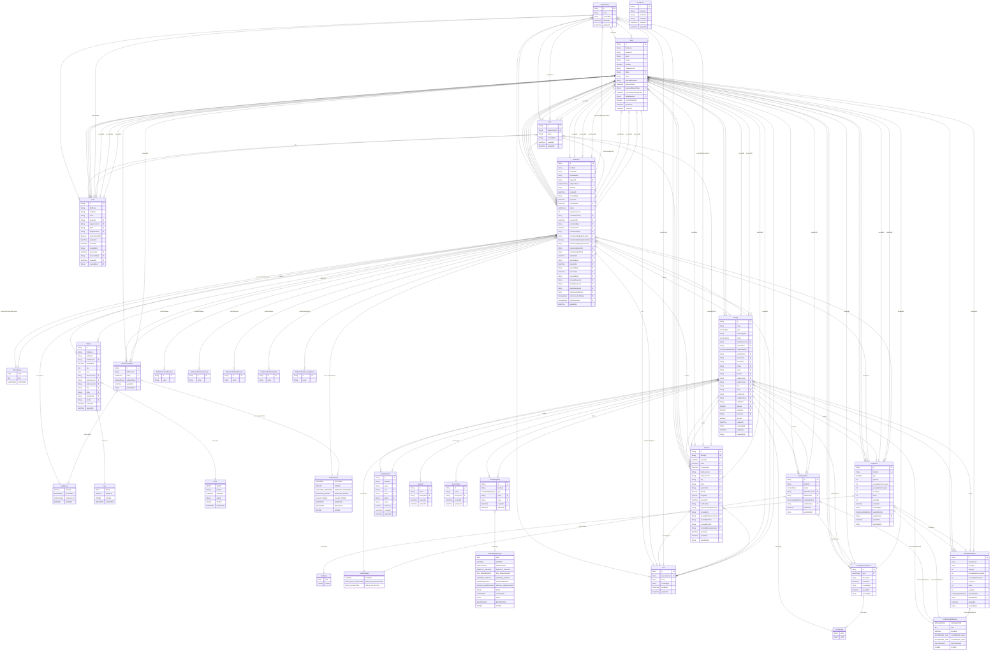

```mermaid
erDiagram

        BedType {
            BED BED
CHAIR CHAIR
        }
    


        TernaryEnum {
            YES YES
NO NO
UNKNOWN UNKNOWN
        }
    


        FacilityType {
            DIDO DIDO
LESC LESC
        }
    


        FacilityStatus {
            CLOSED CLOSED
OPEN_NOT_ACCEPTING OPEN_NOT_ACCEPTING
OPEN_ACCEPTING OPEN_ACCEPTING
        }
    


        FacilityUpdateMethod {
            INTEGRATION INTEGRATION
API API
MANUAL MANUAL
AUTOMATED_CALL AUTOMATED_CALL
AUTOMATED_TEXT AUTOMATED_TEXT
WHITEBOARD WHITEBOARD
OTHER OTHER
        }
    


        FacilityEligibilityType {
            AGE AGE
GENDER GENDER
AMBULATORY AMBULATORY
MOBILITY_DEVICES MOBILITY_DEVICES
ADL_INDEPENDENT ADL_INDEPENDENT
HOUSING_STATUS HOUSING_STATUS
NEIGHBORHOOD NEIGHBORHOOD
SEXUAL_ORIENTATION SEXUAL_ORIENTATION
RACE RACE
LANGUAGE LANGUAGE
PETS PETS
BELONGINGS BELONGINGS
OTHER OTHER
        }
    


        HoldStatus {
            ACTIVE ACTIVE
EXTENDED EXTENDED
CANCELLED CANCELLED
EXPIRED EXPIRED
        }
    


        Sex {
            MALE MALE
FEMALE FEMALE
OTHER OTHER
UNKNOWN UNKNOWN
        }
    


        Race {
            WHITE WHITE
BLACK BLACK
HISPANIC HISPANIC
ASIAN ASIAN
OTHER OTHER
UNKNOWN UNKNOWN
        }
    


        SubjectStatus {
            DETAINED DETAINED
ONSITE ONSITE
AWAITING_TRANSFER AWAITING_TRANSFER
AWAITING_INTAKE AWAITING_INTAKE
FAILED_INTAKE FAILED_INTAKE
ADMITTED ADMITTED
RELEASED RELEASED
EXITED EXITED
        }
    
  "Organization" {
    String id "🗝️"
    String name 
    String createdById 
    DateTime createdAt 
    DateTime updatedAt 
    }
  

  "Unit" {
    String id "🗝️"
    String organizationId "🗝️"
    String name 
    String createdById 
    DateTime createdAt 
    DateTime updatedAt 
    }
  

  "Title" {
    String id "🗝️"
    String organizationId "🗝️"
    String name 
    String createdById 
    DateTime createdAt 
    DateTime updatedAt 
    }
  

  "User" {
    String id "🗝️"
    String firstName 
    String lastName 
    String email 
    String picture "❓"
    Boolean isAdmin 
    String organizationId "❓"
    String titleId "❓"
    String unitId "❓"
    String hashedPassword 
    DateTime deactivatedAt "❓"
    String passwordResetToken "❓"
    DateTime passwordResetExpiresAt "❓"
    String badgeNumber "❓"
    Boolean prop115Certified 
    DateTime updatedAt 
    DateTime createdAt 
    }
  

  "Invite" {
    String id "🗝️"
    String firstName 
    String lastName 
    String email 
    String message "❓"
    String organizationId "❓"
    String titleId "❓"
    String badgeNumber "❓"
    Boolean prop115Certified 
    DateTime updatedAt 
    DateTime createdAt 
    String createdById 
    DateTime acceptedAt "❓"
    String acceptedById "❓"
    DateTime revokedAt "❓"
    String revokedById "❓"
    }
  

  "Facility" {
    String id "🗝️"
    String name 
    FacilityType type 
    String serviceTypeId 
    FacilityStatus status 
    String statusReasonId "❓"
    String statusOther "❓"
    FacilityUpdateMethod updateMethod 
    String updateNotes "❓"
    String subdomain "❓"
    String description "❓"
    String phone "❓"
    String email "❓"
    String website "❓"
    String addressLine1 "❓"
    String addressLine2 "❓"
    String city "❓"
    String state "❓"
    String postalCode "❓"
    String neighborhood "❓"
    String nstDistrict "❓"
    Decimal latitude "❓"
    Decimal longitude "❓"
    String timezone "❓"
    Boolean isActive 
    DateTime createdAt 
    String createdById 
    DateTime updatedAt 
    String updatedById 
    }
  

  "FacilityUpdate" {
    String id "🗝️"
    String facilityId 
    FacilityStatus status 
    String statusReasonId "❓"
    String statusOther "❓"
    FacilityUpdateMethod updateMethod 
    String updateNotes "❓"
    DateTime updatedAt 
    String updatedById 
    }
  

  "FacilityStatusReason" {
    String id "🗝️"
    FacilityType type "❓"
    String description 
    DateTime createdAt 
    String createdById 
    DateTime updatedAt 
    String updatedById 
    }
  

  "FacilityContact" {
    String id "🗝️"
    String facilityId 
    String name 
    String role "❓"
    String email "❓"
    String phone "❓"
    String notes "❓"
    Boolean isPrimary 
    DateTime createdAt 
    DateTime updatedAt 
    }
  

  "Amenity" {
    String id "🗝️"
    String name 
    String description "❓"
    DateTime createdAt 
    DateTime updatedAt 
    }
  

  "ServiceType" {
    String id "🗝️"
    String name 
    String description "❓"
    DateTime createdAt 
    DateTime updatedAt 
    }
  

  "BedStatus" {
    String id "🗝️"
    String facilityId "🗝️"
    BedType type 
    Int capacity 
    Int unavailableUnoccupied 
    Int unavailableOccupied 
    Int occupied 
    Int holds 
    Int available 
    DateTime createdAt 
    String createdById 
    FacilityUpdateMethod updateMethod 
    String updateNotes "❓"
    DateTime updatedAt 
    String updatedById 
    }
  

  "BedStatusUpdate" {
    String id "🗝️"
    String bedStatusId 
    String facilityId 
    Int capacity 
    Int unavailableUnoccupied 
    Int unavailableOccupied 
    Int occupied 
    Int holds 
    Int available 
    FacilityUpdateMethod updateMethod 
    String updateNotes "❓"
    DateTime updatedAt 
    String updatedById 
    }
  

  "FacilityEligibility" {
    String id "🗝️"
    String facilityId 
    FacilityEligibilityType type 
    String value "❓"
    String notes "❓"
    DateTime createdAt 
    DateTime updatedAt 
    }
  

  "Subject" {
    String id "🗝️"
    String firstName 
    String lastName 
    String middleInitial "❓"
    DateTime dateOfBirth 
    Sex sex 
    Race race 
    String driverLicense "❓"
    String addressLine1 "❓"
    String addressLine2 "❓"
    String city "❓"
    String state "❓"
    String postalCode "❓"
    String localId "❓"
    DateTime createdAt 
    DateTime updatedAt 
    }
  

  "Deflection" {
    String id "🗝️"
    String facilityId 
    String incidentId 
    String bedStatusId 
    String subjectId "❓"
    SubjectStatus subjectStatus 
    String behavior "❓"
    DateTime createdAt 
    String createdById 
    DateTime expiresAt 
    DateTime completedAt "❓"
    HoldStatus status 
    Int extensionCount 
    String cancelReasonId "❓"
    DateTime cancelledAt "❓"
    String cancelledById "❓"
    DateTime transferredAt "❓"
    String transferredById "❓"
    String transferredByBadgeNumber "❓"
    Boolean transferredByProp115Certified "❓"
    String transferredByOrganizationId "❓"
    String transferredByUnitId "❓"
    String transferredByTitleId "❓"
    DateTime admittedAt "❓"
    String admittedById "❓"
    DateTime rejectedAt "❓"
    String rejectedById "❓"
    DateTime releasedAt "❓"
    String releasedById "❓"
    String releaseReasonId "❓"
    String refusalReasonId "❓"
    String exitDestinationId "❓"
    String exitHousingStatusId "❓"
    TernaryEnum exitConnectedToCare "❓"
    TernaryEnum exitSFResident "❓"
    DateTime updatedAt 
    }
  

  "DeflectionUpdate" {
    String id "🗝️"
    String deflectionId 
    HoldStatus status "❓"
    SubjectStatus subjectStatus "❓"
    DateTime updatedAt 
    String updatedById 
    }
  

  "DeflectionCancelReason" {
    String id "🗝️"
    String name 
    }
  

  "DeflectionReleaseReason" {
    String id "🗝️"
    String name 
    }
  

  "DeflectionRefusalReason" {
    String id "🗝️"
    String name 
    }
  

  "DeflectionExitDestination" {
    String id "🗝️"
    String name 
    }
  

  "DeflectionExitHousingStatus" {
    String id "🗝️"
    String name 
    }
  

  "Incident" {
    String id "🗝️"
    String facilityId "🗝️"
    DateTime arrivedAt "❓"
    DateTime leftAt "❓"
    DateTime completedAt "❓"
    String addressLine1 "❓"
    String addressLine2 "❓"
    String city "❓"
    String state "❓"
    String postalCode "❓"
    Decimal latitude "❓"
    Decimal longitude "❓"
    DateTime arrestedAt "❓"
    String cadNumber "❓"
    String supervisorBadgeNumber "❓"
    String createdById 
    String createdByOrganizationId "❓"
    String createdByTitleId "❓"
    String createdByUnitId "❓"
    String createdByBadgeNumber "❓"
    DateTime createdAt 
    DateTime updatedAt 
    String updatedById 
    }
  

  "Feedback" {
    String id "🗝️"
    String message 
    String userEmail "❓"
    String userAgent "❓"
    DateTime createdAt 
    DateTime updatedAt 
    }
  
    "Organization" o|--|| "User" : "createdBy"
    "Organization" o{--}o "Deflection" : ""
    "Organization" o{--}o "Incident" : ""
    "Organization" o{--}o "Invite" : ""
    "Organization" o{--}o "Title" : ""
    "Organization" o{--}o "Unit" : ""
    "Organization" o{--}o "User" : ""
    "Unit" o|--|| "Organization" : "organization"
    "Unit" o|--|| "User" : "createdBy"
    "Unit" o{--}o "Deflection" : ""
    "Unit" o{--}o "Incident" : ""
    "Unit" o{--}o "User" : ""
    "Title" o|--|| "Organization" : "organization"
    "Title" o|--|| "User" : "createdBy"
    "Title" o{--}o "Deflection" : ""
    "Title" o{--}o "Incident" : ""
    "Title" o{--}o "Invite" : ""
    "Title" o{--}o "User" : ""
    "User" o|--|o "Organization" : "organization"
    "User" o|--|o "Title" : "title"
    "User" o|--|o "Unit" : "unit"
    "User" o{--}o "BedStatus" : ""
    "User" o{--}o "BedStatus" : ""
    "User" o{--}o "BedStatusUpdate" : ""
    "User" o{--}o "Deflection" : ""
    "User" o{--}o "Deflection" : ""
    "User" o{--}o "Deflection" : ""
    "User" o{--}o "Deflection" : ""
    "User" o{--}o "Deflection" : ""
    "User" o{--}o "Deflection" : ""
    "User" o{--}o "DeflectionUpdate" : ""
    "User" o{--}o "Facility" : ""
    "User" o{--}o "Facility" : ""
    "User" o{--}o "FacilityStatusReason" : ""
    "User" o{--}o "FacilityStatusReason" : ""
    "User" o{--}o "FacilityUpdate" : ""
    "User" o{--}o "Incident" : ""
    "User" o{--}o "Incident" : ""
    "User" o{--}o "Invite" : ""
    "User" o{--}o "Invite" : ""
    "User" o{--}o "Invite" : ""
    "Invite" o|--|o "Organization" : "organization"
    "Invite" o|--|o "Title" : "title"
    "Invite" o|--|| "User" : "createdBy"
    "Invite" o|--|o "User" : "acceptedBy"
    "Invite" o|--|o "User" : "revokedBy"
    "Facility" o|--|| "FacilityType" : "enum:type"
    "Facility" o|--|| "ServiceType" : "serviceType"
    "Facility" o|--|| "FacilityStatus" : "enum:status"
    "Facility" o|--|o "FacilityStatusReason" : "statusReason"
    "Facility" o|--|| "FacilityUpdateMethod" : "enum:updateMethod"
    "Facility" o|--|| "User" : "createdBy"
    "Facility" o|--|| "User" : "updatedBy"
    "Facility" o{--}o "Amenity" : ""
    "Facility" o{--}o "BedStatus" : ""
    "Facility" o{--}o "BedStatusUpdate" : ""
    "Facility" o{--}o "FacilityContact" : ""
    "Facility" o{--}o "Deflection" : ""
    "Facility" o{--}o "FacilityEligibility" : ""
    "Facility" o{--}o "Incident" : ""
    "Facility" o{--}o "FacilityUpdate" : ""
    "FacilityUpdate" o|--|| "Facility" : "facility"
    "FacilityUpdate" o|--|| "FacilityStatus" : "enum:status"
    "FacilityUpdate" o|--|o "FacilityStatusReason" : "statusReason"
    "FacilityUpdate" o|--|| "FacilityUpdateMethod" : "enum:updateMethod"
    "FacilityUpdate" o|--|| "User" : "updatedBy"
    "FacilityStatusReason" o|--|o "FacilityType" : "enum:type"
    "FacilityStatusReason" o|--|| "User" : "createdBy"
    "FacilityStatusReason" o|--|| "User" : "updatedBy"
    "FacilityContact" o|--|| "Facility" : "facility"
    "BedStatus" o|--|| "Facility" : "facility"
    "BedStatus" o|--|| "BedType" : "enum:type"
    "BedStatus" o|--|| "User" : "createdBy"
    "BedStatus" o|--|| "FacilityUpdateMethod" : "enum:updateMethod"
    "BedStatus" o|--|| "User" : "updatedBy"
    "BedStatus" o{--}o "Deflection" : ""
    "BedStatus" o{--}o "BedStatusUpdate" : ""
    "BedStatusUpdate" o|--|| "BedStatus" : "bedStatus"
    "BedStatusUpdate" o|--|| "Facility" : "facility"
    "BedStatusUpdate" o|--|| "FacilityUpdateMethod" : "enum:updateMethod"
    "BedStatusUpdate" o|--|| "User" : "updatedBy"
    "FacilityEligibility" o|--|| "Facility" : "facility"
    "FacilityEligibility" o|--|| "FacilityEligibilityType" : "enum:type"
    "Subject" o|--|| "Sex" : "enum:sex"
    "Subject" o|--|| "Race" : "enum:race"
    "Subject" o{--}o "Deflection" : ""
    "Deflection" o|--|| "Facility" : "facility"
    "Deflection" o|--|| "Incident" : "incident"
    "Deflection" o|--|| "BedStatus" : "bedStatus"
    "Deflection" o|--|o "Subject" : "subject"
    "Deflection" o|--|| "SubjectStatus" : "enum:subjectStatus"
    "Deflection" o|--|| "User" : "createdBy"
    "Deflection" o|--|| "HoldStatus" : "enum:status"
    "Deflection" o|--|o "DeflectionCancelReason" : "cancelReason"
    "Deflection" o|--|o "User" : "cancelledBy"
    "Deflection" o|--|o "User" : "transferredBy"
    "Deflection" o|--|o "Organization" : "transferredByOrganization"
    "Deflection" o|--|o "Unit" : "transferredByUnit"
    "Deflection" o|--|o "Title" : "transferredByTitle"
    "Deflection" o|--|o "User" : "admittedBy"
    "Deflection" o|--|o "User" : "rejectedBy"
    "Deflection" o|--|o "User" : "releasedBy"
    "Deflection" o|--|o "DeflectionReleaseReason" : "releaseReason"
    "Deflection" o|--|o "DeflectionRefusalReason" : "refusalReason"
    "Deflection" o|--|o "DeflectionExitDestination" : "exitDestination"
    "Deflection" o|--|o "DeflectionExitHousingStatus" : "exitHousingStatus"
    "Deflection" o|--|o "TernaryEnum" : "enum:exitConnectedToCare"
    "Deflection" o|--|o "TernaryEnum" : "enum:exitSFResident"
    "Deflection" o{--}o "DeflectionUpdate" : ""
    "DeflectionUpdate" o|--|| "Deflection" : "deflection"
    "DeflectionUpdate" o|--|o "HoldStatus" : "enum:status"
    "DeflectionUpdate" o|--|o "SubjectStatus" : "enum:subjectStatus"
    "DeflectionUpdate" o|--|| "User" : "updatedBy"
    "Incident" o|--|| "Facility" : "facility"
    "Incident" o|--|| "User" : "createdBy"
    "Incident" o|--|o "Organization" : "createdByOrganization"
    "Incident" o|--|o "Title" : "createdByTitle"
    "Incident" o|--|o "Unit" : "createdByUnit"
    "Incident" o|--|| "User" : "updatedBy"
```
