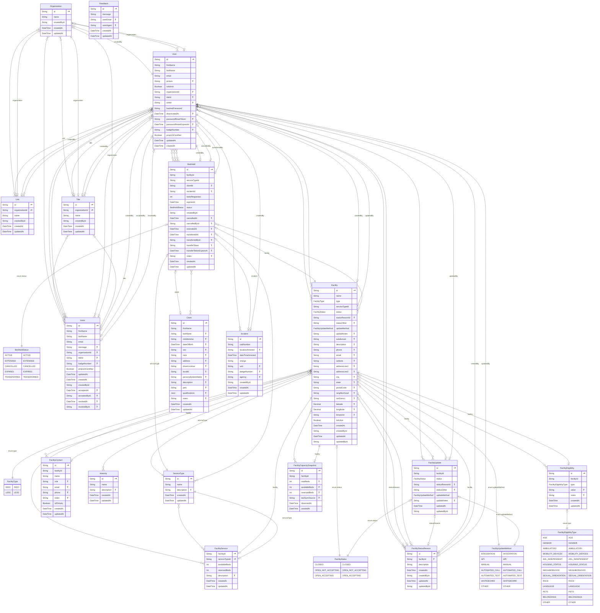

```mermaid
erDiagram

        FacilityType {
            DIDO DIDO
LESC LESC
        }
    


        FacilityStatus {
            CLOSED CLOSED
OPEN_NOT_ACCEPTING OPEN_NOT_ACCEPTING
OPEN_ACCEPTING OPEN_ACCEPTING
        }
    


        FacilityUpdateMethod {
            INTEGRATION INTEGRATION
API API
MANUAL MANUAL
AUTOMATED_CALL AUTOMATED_CALL
AUTOMATED_TEXT AUTOMATED_TEXT
WHITEBOARD WHITEBOARD
OTHER OTHER
        }
    


        FacilityEligibilityType {
            AGE AGE
GENDER GENDER
AMBULATORY AMBULATORY
MOBILITY_DEVICES MOBILITY_DEVICES
ADL_INDEPENDENT ADL_INDEPENDENT
HOUSING_STATUS HOUSING_STATUS
NEIGHBORHOOD NEIGHBORHOOD
SEXUAL_ORIENTATION SEXUAL_ORIENTATION
RACE RACE
LANGUAGE LANGUAGE
PETS PETS
BELONGINGS BELONGINGS
OTHER OTHER
        }
    


        BedHoldStatus {
            ACTIVE ACTIVE
EXTENDED EXTENDED
CANCELLED CANCELLED
EXPIRED EXPIRED
TRANSFERRED TRANSFERRED
        }
    
  "Organization" {
    String id "🗝️"
    String name 
    String createdById 
    DateTime createdAt 
    DateTime updatedAt 
    }
  

  "Unit" {
    String id "🗝️"
    String organizationId "🗝️"
    String name 
    String createdById 
    DateTime createdAt 
    DateTime updatedAt 
    }
  

  "Title" {
    String id "🗝️"
    String organizationId "🗝️"
    String name 
    String createdById 
    DateTime createdAt 
    DateTime updatedAt 
    }
  

  "User" {
    String id "🗝️"
    String firstName 
    String lastName 
    String email 
    String picture "❓"
    Boolean isAdmin 
    String organizationId "❓"
    String titleId "❓"
    String unitId "❓"
    String hashedPassword 
    DateTime deactivatedAt "❓"
    String passwordResetToken "❓"
    DateTime passwordResetExpiresAt "❓"
    String badgeNumber "❓"
    Boolean prop115Certified 
    DateTime updatedAt 
    DateTime createdAt 
    }
  

  "Invite" {
    String id "🗝️"
    String firstName 
    String lastName 
    String email 
    String message "❓"
    String organizationId "❓"
    String titleId "❓"
    String badgeNumber "❓"
    Boolean prop115Certified 
    DateTime updatedAt 
    DateTime createdAt 
    String createdById 
    DateTime acceptedAt "❓"
    String acceptedById "❓"
    DateTime revokedAt "❓"
    String revokedById "❓"
    }
  

  "Facility" {
    String id "🗝️"
    String name 
    FacilityType type 
    String serviceTypeId 
    FacilityStatus status 
    String statusReasonId "❓"
    String statusOther "❓"
    FacilityUpdateMethod updateMethod 
    String updateNotes "❓"
    String subdomain "❓"
    String description "❓"
    String phone "❓"
    String email "❓"
    String website "❓"
    String addressLine1 "❓"
    String addressLine2 "❓"
    String city "❓"
    String state "❓"
    String postalCode "❓"
    String neighborhood "❓"
    String nstDistrict "❓"
    Decimal latitude "❓"
    Decimal longitude "❓"
    String timezone "❓"
    Boolean isActive 
    DateTime createdAt 
    String createdById 
    DateTime updatedAt 
    String updatedById 
    }
  

  "FacilityUpdate" {
    String id "🗝️"
    String facilityId 
    FacilityStatus status 
    String statusReasonId "❓"
    String statusOther "❓"
    FacilityUpdateMethod updateMethod 
    String updateNotes "❓"
    DateTime updatedAt 
    String updatedById 
    }
  

  "FacilityStatusReason" {
    String id "🗝️"
    String facilityId "❓"
    String description 
    DateTime createdAt 
    String createdById 
    DateTime updatedAt 
    String updatedById 
    }
  

  "FacilityContact" {
    String id "🗝️"
    String facilityId 
    String name 
    String role "❓"
    String email "❓"
    String phone "❓"
    String notes "❓"
    Boolean isPrimary 
    DateTime createdAt 
    DateTime updatedAt 
    }
  

  "Amenity" {
    String id "🗝️"
    String name 
    String description "❓"
    DateTime createdAt 
    DateTime updatedAt 
    }
  

  "ServiceType" {
    String id "🗝️"
    String name 
    String description "❓"
    DateTime createdAt 
    DateTime updatedAt 
    }
  

  "FacilityService" {
    String facilityId "🗝️"
    String serviceTypeId "🗝️"
    Int availableBeds 
    Int reservedBeds 
    String description "❓"
    DateTime createdAt 
    DateTime updatedAt 
    }
  

  "FacilityEligibility" {
    String id "🗝️"
    String facilityId 
    FacilityEligibilityType type 
    String value "❓"
    String notes "❓"
    DateTime createdAt 
    DateTime updatedAt 
    }
  

  "FacilityCapacitySnapshot" {
    String id "🗝️"
    String facilityId 
    Int totalBeds "❓"
    Int availableBeds "❓"
    Int reservedBeds "❓"
    String lastSyncSource "❓"
    DateTime observedAt 
    DateTime createdAt 
    }
  

  "Client" {
    String id "🗝️"
    String firstName 
    String lastName "❓"
    String middleInitial "❓"
    DateTime dateOfBirth "❓"
    String sex "❓"
    String race "❓"
    String address "❓"
    String driverLicense "❓"
    String localId "❓"
    String personallyIdentifiable "❓"
    String description "❓"
    String pets "❓"
    Json qualifications "❓"
    String notes "❓"
    DateTime createdAt 
    DateTime updatedAt 
    }
  

  "BedHold" {
    String id "🗝️"
    String facilityId 
    String serviceTypeId 
    String clientId "❓"
    String incidentId "❓"
    Int bedsRequested 
    DateTime expiresAt 
    BedHoldStatus status 
    String createdById 
    DateTime cancelledAt "❓"
    String cancelledById "❓"
    DateTime extendedAt "❓"
    DateTime transferredAt "❓"
    String transferredById "❓"
    String transferToken "❓"
    DateTime transferTokenExpiresAt "❓"
    String notes "❓"
    DateTime createdAt 
    DateTime updatedAt 
    }
  

  "Incident" {
    String id "🗝️"
    String cadNumber 
    String locationArrested "❓"
    DateTime dateTimeArrested 
    String charge 
    String unit "❓"
    String badgeNumber "❓"
    String agency "❓"
    String createdById 
    DateTime createdAt 
    DateTime updatedAt 
    }
  

  "Feedback" {
    String id "🗝️"
    String message 
    String userEmail "❓"
    String userAgent "❓"
    DateTime createdAt 
    DateTime updatedAt 
    }
  
    "Organization" o|--|| "User" : "createdBy"
    "Organization" o{--}o "Unit" : ""
    "Organization" o{--}o "Title" : ""
    "Organization" o{--}o "Invite" : ""
    "Organization" o{--}o "User" : ""
    "Unit" o|--|| "Organization" : "organization"
    "Unit" o|--|| "User" : "createdBy"
    "Unit" o{--}o "User" : ""
    "Title" o|--|| "Organization" : "organization"
    "Title" o|--|| "User" : "createdBy"
    "Title" o{--}o "Invite" : ""
    "Title" o{--}o "User" : ""
    "User" o|--|o "Organization" : "organization"
    "User" o|--|o "Title" : "title"
    "User" o|--|o "Unit" : "unit"
    "User" o{--}o "BedHold" : ""
    "User" o{--}o "BedHold" : ""
    "User" o{--}o "BedHold" : ""
    "User" o{--}o "Facility" : ""
    "User" o{--}o "Facility" : ""
    "User" o{--}o "FacilityStatusReason" : ""
    "User" o{--}o "FacilityStatusReason" : ""
    "User" o{--}o "FacilityUpdate" : ""
    "User" o{--}o "Incident" : ""
    "User" o{--}o "Invite" : ""
    "User" o{--}o "Invite" : ""
    "User" o{--}o "Invite" : ""
    "Invite" o|--|o "Organization" : "organization"
    "Invite" o|--|o "Title" : "title"
    "Invite" o|--|| "User" : "createdBy"
    "Invite" o|--|o "User" : "acceptedBy"
    "Invite" o|--|o "User" : "revokedBy"
    "Facility" o|--|| "FacilityType" : "enum:type"
    "Facility" o|--|| "ServiceType" : "serviceType"
    "Facility" o|--|| "FacilityStatus" : "enum:status"
    "Facility" o|--|o "FacilityStatusReason" : "statusReason"
    "Facility" o|--|| "FacilityUpdateMethod" : "enum:updateMethod"
    "Facility" o|--|| "User" : "createdBy"
    "Facility" o|--|| "User" : "updatedBy"
    "Facility" o{--}o "Amenity" : ""
    "Facility" o{--}o "BedHold" : ""
    "Facility" o{--}o "FacilityCapacitySnapshot" : ""
    "Facility" o{--}o "FacilityContact" : ""
    "Facility" o{--}o "FacilityEligibility" : ""
    "Facility" o{--}o "FacilityService" : ""
    "Facility" o{--}o "FacilityStatusReason" : ""
    "Facility" o{--}o "FacilityUpdate" : ""
    "FacilityUpdate" o|--|| "Facility" : "facility"
    "FacilityUpdate" o|--|| "FacilityStatus" : "enum:status"
    "FacilityUpdate" o|--|o "FacilityStatusReason" : "statusReason"
    "FacilityUpdate" o|--|| "FacilityUpdateMethod" : "enum:updateMethod"
    "FacilityUpdate" o|--|| "User" : "updatedBy"
    "FacilityStatusReason" o|--|o "Facility" : "facility"
    "FacilityStatusReason" o|--|| "User" : "createdBy"
    "FacilityStatusReason" o|--|| "User" : "updatedBy"
    "FacilityContact" o|--|| "Facility" : "facility"
    "ServiceType" o{--}o "FacilityService" : ""
    "ServiceType" o{--}o "BedHold" : ""
    "FacilityService" o|--|| "Facility" : "facility"
    "FacilityService" o|--|| "ServiceType" : "serviceType"
    "FacilityEligibility" o|--|| "Facility" : "facility"
    "FacilityEligibility" o|--|| "FacilityEligibilityType" : "enum:type"
    "FacilityCapacitySnapshot" o|--|| "Facility" : "facility"
    "Client" o{--}o "BedHold" : ""
    "BedHold" o|--|| "Facility" : "facility"
    "BedHold" o|--|| "ServiceType" : "serviceType"
    "BedHold" o|--|o "Client" : "client"
    "BedHold" o|--|o "Incident" : "incident"
    "BedHold" o|--|| "BedHoldStatus" : "enum:status"
    "BedHold" o|--|| "User" : "createdBy"
    "BedHold" o|--|o "User" : "cancelledBy"
    "BedHold" o|--|o "User" : "transferredBy"
    "Incident" o|--|| "User" : "createdBy"
```
